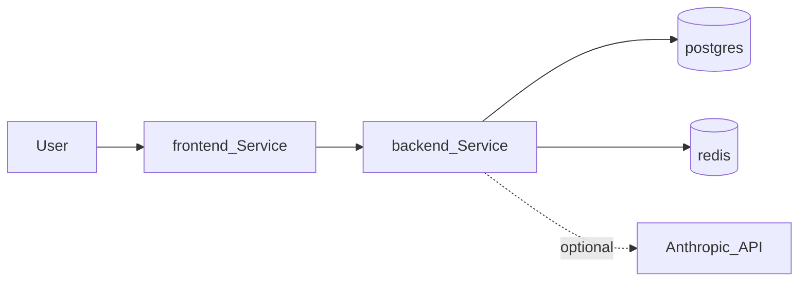

# Quest Mode — data flow

High-level request and data paths for the local Minikube stack.

- **User → frontend**: Browser hits the `frontend` Service (e.g. via `kubectl port-forward` or ingress you add later); nginx serves static assets from the Vite build.
- **Frontend → backend**: API calls target the `backend` Service DNS name `backend.quest-mode.svc` (or `http://backend:8080` from another pod in the cluster).
- **Backend → Postgres / Redis**: Connection strings come from the `quest-secrets` Secret (`DATABASE_URL`, `REDIS_URL`).
- **Backend → Anthropic**: When implemented, the backend uses `ANTHROPIC_API_KEY` from the same Secret for outbound calls to Anthropic’s API (not shown as in-cluster traffic).

Update this diagram when you add ingress, TLS, message queues, or external identity providers.
