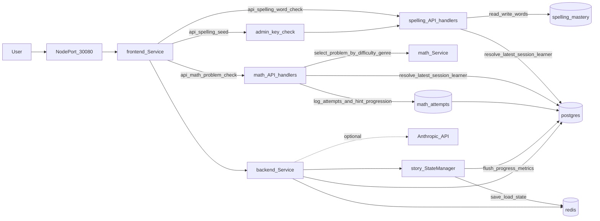
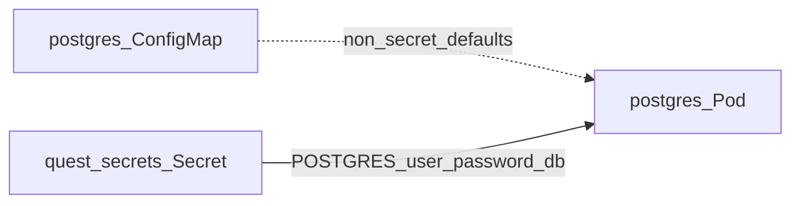
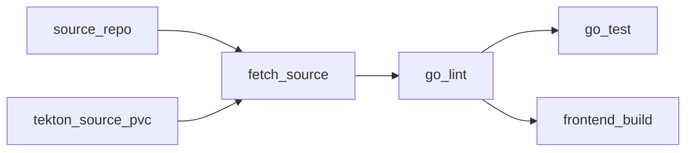

# Quest Mode — data flow

High-level request and data paths for the local Minikube stack.

Postgres bootstrap credentials (in-cluster):

- **User → frontend**: Browser hits the `frontend` Service. On Minikube, the Service is a **NodePort** (`30080`); open `http://$(minikube ip):30080` on the host. You can also use `kubectl port-forward -n quest-mode svc/frontend 8081:80`. Nginx serves the Vite build from `/usr/share/nginx/html` and uses SPA fallback (`try_files` → `index.html`).
- **Frontend → backend**: In the cluster, nginx proxies `/api/*` to `http://backend:8080/api/*`. The browser can call same-origin `/api/...` (no CORS needed). The backend Service DNS name is `backend.quest-mode.svc` (short name `backend` within the namespace).
- **Backend → Postgres / Redis**: Connection strings come from the `quest-secrets` Secret (`DATABASE_URL`, `REDIS_URL`). On startup the backend applies SQL migrations from `backend/migrations/` (embedded in the binary) and records them in `schema_migrations`; Kubernetes readiness uses `GET /api/health` on port 8080.
- **Spelling task API**: `GET /api/spelling/word` and `POST /api/spelling/check` resolve the learner from the latest `quest_sessions` row and read/write progress in `spelling_mastery` (`correct_count`, `hint_count`, `last_seen_at`, `mastered_at`).
- **Math task API**: `GET /api/math/problem` selects a static problem by difficulty/genre (with frustration downgrade support), and `POST /api/math/check` validates answers, stores attempts in `math_attempts`, and returns progressive feedback (`Hint1` -> `Hint2` -> reveal).
- **Admin seed protection**: `POST /api/spelling/seed` requires `X-Admin-Key` to match `ADMIN_KEY` before inserting learner words into `spelling_mastery`.
- **Story state machine**: Story runtime state is cached in Redis using `story:state:{learnerID}` with 24-hour TTL and flushed to `quest_sessions` in Postgres (`tasks_completed`, `engagement_seconds`) by `session_id`.
- **Postgres Pod**: The `postgres` Deployment mounts data on PVC `quest-postgres-pvc` and sets `POSTGRES_USER`, `POSTGRES_PASSWORD`, and `POSTGRES_DB` from `quest-secrets`. Non-sensitive defaults for user and database name are also recorded in the `postgres-config` ConfigMap (`k8s/postgres/configmap.yaml`); keep them aligned with the Secret when you change credentials.
- **Backend → Anthropic**: When implemented, the backend uses `ANTHROPIC_API_KEY` from the same Secret for outbound calls to Anthropic’s API (not shown as in-cluster traffic).

Update this diagram when you add ingress, TLS, message queues, or external identity providers.

## Tekton CI flow (Minikube)

- **Source fetch**: `fetch-source` validates `repo-url` and `revision`, then checks out the requested ref into the shared workspace.
- **Shared workspace**: `tekton-source-pvc` is mounted as the `source` workspace for all CI tasks.
- **Quality gates**: `go-lint` runs `gofmt` and `go vet`; `go-test` and `frontend-build` run in parallel after lint passes.
- **Deploy flow**: image build and deployment restart are handled separately by local script `./scripts/build-all.sh` against Minikube's Docker daemon.
