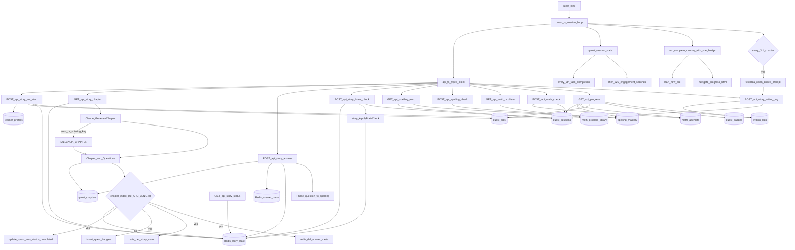

# QuestMode Data Flow Diagram

```mermaid
flowchart TD
    questHtml[quest_html] --> questLoop[quest_ts_session_loop]
    questLoop --> apiClient[api_ts_typed_client]
    questLoop --> progressState[quest_session_state]
    progressState --> brainCheckGate[every_5th_task_completion]
    progressState --> breakGate[after_720_engagement_seconds]

    apiClient --> startArc
    apiClient --> getChapter
    apiClient --> submitAnswer
    apiClient --> brainCheck
    apiClient --> spellingWord[GET_api_spelling_word]
    apiClient --> spellingCheck[POST_api_spelling_check]
    apiClient --> mathProblem[GET_api_math_problem]
    apiClient --> mathCheck[POST_api_math_check]
    apiClient --> progressGet[GET_api_progress]
    apiClient --> writingLog[POST_api_story_writing_log]

    startArc[POST_api_story_arc_start] --> learnerProfiles[(learner_profiles)]
    startArc --> questArcs[(quest_arcs)]
    startArc --> storyStateRedis[(Redis_story_state)]
    startArc --> questSessions[(quest_sessions)]

    getChapter[GET_api_story_chapter] --> storyStateRedis
    getChapter --> claudeGenerate[Claude_GenerateChapter]
    claudeGenerate -->|"error_or_missing_key"| fallbackChapter[FALLBACK_CHAPTER]
    claudeGenerate --> chapterPayload[Chapter_and_Questions]
    fallbackChapter --> chapterPayload
    chapterPayload --> questChapters[(quest_chapters)]
    chapterPayload --> arcLengthCheck{chapter_index_gte_ARC_LENGTH}
    arcLengthCheck -->|no| storyStateRedis
    arcLengthCheck -->|yes| arcStatusComplete[update_quest_arcs_status_completed]
    arcLengthCheck -->|yes| badgeInsert[insert_quest_badges]
    arcLengthCheck -->|yes| clearStoryState[redis_del_story_state]
    arcLengthCheck -->|yes| clearAnswerMeta[redis_del_answer_meta]

    submitAnswer[POST_api_story_answer] --> questChapters
    submitAnswer --> answerMetaRedis[(Redis_answer_meta)]
    submitAnswer --> storyStateRedis
    submitAnswer --> phaseTransition[Phase_question_to_spelling]

    brainCheck[POST_api_story_brain_check] --> storyStateRedis
    brainCheck --> applyBrainCheck[story_ApplyBrainCheck]
    applyBrainCheck --> storyStateRedis
    brainCheck --> questSessions

    spellingWord --> questSessions
    spellingWord --> spellingMastery[(spelling_mastery)]
    spellingCheck --> spellingMastery

    mathProblem --> mathLibrary[(math_problem_library)]
    mathCheck --> mathAttempts[(math_attempts)]
    mathCheck --> questSessions
    questLoop --> arcCompletionOverlay[arc_complete_overlay_with_star_badge]
    arcCompletionOverlay --> newQuestAction[start_new_arc]
    arcCompletionOverlay --> progressPageAction[navigate_progress_html]
    questLoop --> writingPromptGate{every_3rd_chapter}
    writingPromptGate -->|yes| writingPromptUI[textarea_open_ended_prompt]
    writingPromptUI --> writingLog[POST_api_story_writing_log]
    progressGet --> questSessions
    progressGet --> spellingMastery
    progressGet --> mathAttempts
    progressGet --> questArcs
    progressGet --> questBadges[(quest_badges)]
    progressGet --> writingLogs[(writing_logs)]
    writingLog --> writingLogs
    writingLog --> questSessions

    statusGet[GET_api_story_status] --> storyStateRedis
```
