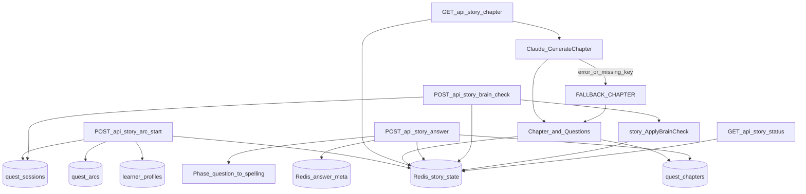

# QuestMode Data Flow Diagram

```mermaid
flowchart TD
    startArc[POST_api_story_arc_start] --> learnerProfiles[(learner_profiles)]
    startArc --> questArcs[(quest_arcs)]
    startArc --> storyStateRedis[(Redis_story_state)]
    startArc --> questSessions[(quest_sessions)]

    getChapter[GET_api_story_chapter] --> storyStateRedis
    getChapter --> claudeGenerate[Claude_GenerateChapter]
    claudeGenerate -->|"error_or_missing_key"| fallbackChapter[FALLBACK_CHAPTER]
    claudeGenerate --> chapterPayload[Chapter_and_Questions]
    fallbackChapter --> chapterPayload
    chapterPayload --> questChapters[(quest_chapters)]
    chapterPayload --> storyStateRedis

    submitAnswer[POST_api_story_answer] --> questChapters
    submitAnswer --> answerMetaRedis[(Redis_answer_meta)]
    submitAnswer --> storyStateRedis
    submitAnswer --> phaseTransition[Phase_question_to_spelling]

    brainCheck[POST_api_story_brain_check] --> storyStateRedis
    brainCheck --> applyBrainCheck[story_ApplyBrainCheck]
    applyBrainCheck --> storyStateRedis
    brainCheck --> questSessions

    statusGet[GET_api_story_status] --> storyStateRedis
```
